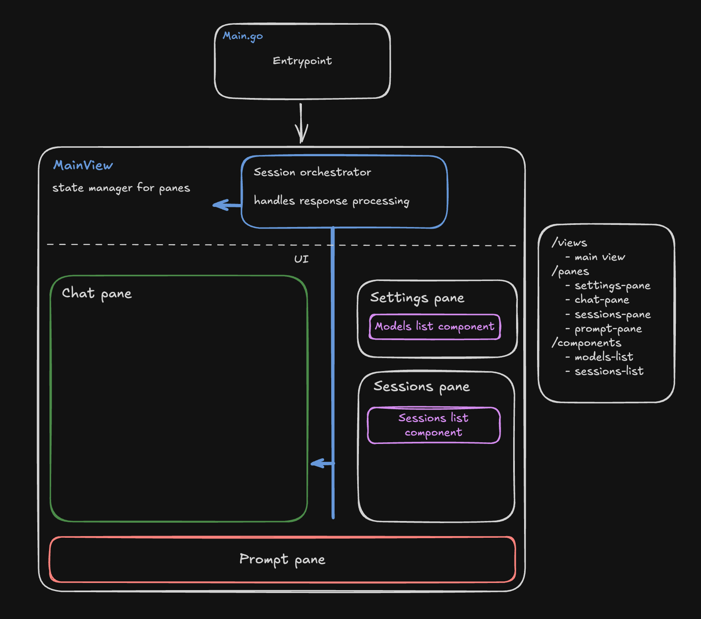

# App structure

To keep things tidy the following approach is used:
  * `views` host and manage `panes` , and `panes` host and manage `components`
  * elements are supposed to be isolated and to communicate using bubbletea events

## Cutting a release

We're using [goreleaser](https://goreleaser.com/) to build and publish releases.

We generally utilize the following workflow:

1. Develop and test locally
2. Cut a release candidate (RC)
3. Test RC for a week or so.
4. Cut a stable release

To cut a release, you need to:

1. Decide if you are cutting a release candidate or stable release.
2. Release candidate? 
  a. Add a git tag: `git tag -a v<your-version>-rc -m "Some message"`
  b. Publish to git: `git push origin v<your-version>-rc`
  c. Watch the [release workflow](https://github.com/tearingItUp786/chatgpt-tui/actions/workflows/release.yaml) run
3. Stable release?
  a. Add a git tag: `git tag -a v<your-version> -m "Some message"`
  b. Publish to git: `git push origin v<your-version>`
  c. Watch the [release workflow](https://github.com/tearingItUp786/chatgpt-tui/actions/workflows/release.yaml) run

### What if my release fails? 

There have been times where we've had issues with our release process. If you're having issues, 
for example, the github action is failing, you can try the following (after diagnosing and fixing the issue):

1. Delete the tag locally: `git tag -d v<your-version>-rc`
2. Delete the tag on github: `https://github.com/tearingItUp786/chatgpt-tui/releases/tag`
3. Run the release workflow again and it should work

